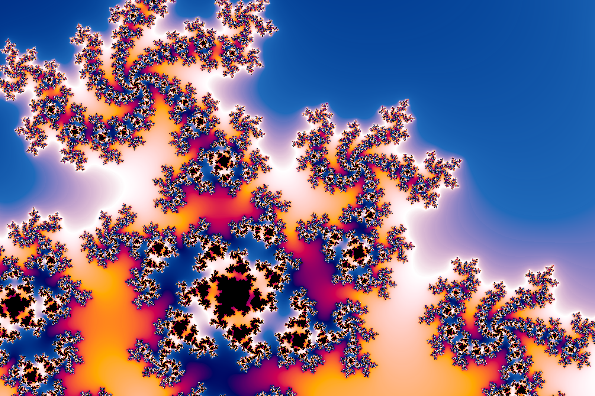
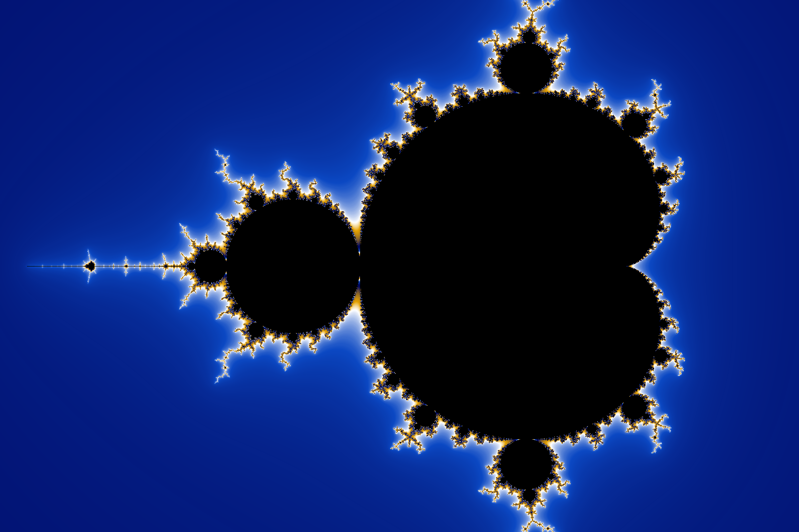
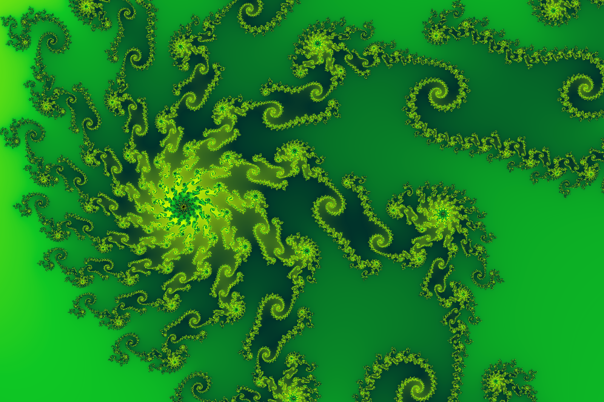

# GoFract
This project is an experiment in using Go to render Mandlebrot and Julia fractals in real-time 

The project uses the [Enbiten](https://ebiten.org/) 2D game library and also [go-colorful](https://github.com/lucasb-eyer/go-colorful) a library for manipulating colours in Go.

It should build & run under both Linux/WSL and Windows, notes are provided below.







Features:
- Mandlebrot and Julia sets
- Zoom in/out with mouse wheel
- Click anywhere to recenter the view
- Press 'h' to show help text
- Press 'z'/'x' to decrease/increase max iterations
- Press 's' to save current view to a PNG file
- Press 'd' to display debugging information
- Press 'r' to randomize the colour pallet
- Press 'b' to change the colour blend mode (RGB, HCL, HSV)
- Press 'l' to reload/reset current fractal
- Use cursor keys to explore when in Julia set mode, by changing the real/imaginary parts of C. This is fun!

## Configuration
Configuration is done via YAML, this is loaded from `fractal.yaml` by default, or the filename can be passed as an argument when starting the app, e.g. `fract foo.yaml` or `go run . foo.yaml`

Below is an example config file, **not every setting needs to be provided**, defaults will be picked if values or sections are omitted. 

Also if the file is not provided, the defaults are used


```yaml
type: julia         # Either 'mandelbrot' or 'julia', default: mandelbrot
maxIter: 200        # Max iterations, default: 90
imageWidth: 1000    # Width of the windows and image, default: 1000
fullScreen: false   # Run fullscreen, default: false

width: 3.0          # Width in the complex plane (real part), default: 3.0
height: 2.0         # Height in the complex plane (imaginary part), default: 2.0
                    # NOTE. The ratio of width:height combined with imageWidth defines the imageHeight
                    #       i.e.  imageHeight = imageWidth * (height / width)
zoom: 1.5           # Starting zoom factor, smaller = more zoomed in, default: 1.0

center:             # Starting location in complex plane, default: [0.0,-0.6]
  r: 0.0
  i: -0.6

juliaC:             # Used when type=julia, complex C seed value used, default: [0.355, 0.355]
  r: -0.54
  i: 0.54

# Array of colors (in hex format), and positions, pos: 0.0 ~ 1.0 
# Minimum of two colors, colors are blended to make a smooth gradient between 0.0 and 1.0
# Tip: The color table wraps, set all positions below 1.0, max about 0.8 or 0.9
colors:              
  - pos: 0.0
    color: "#1aeded"
  - pos: 0.33
    color: "#1a33ed"     
  - pos: 0.66
    color: "#ff0000"
  - pos: 0.8
    color: "#1aeded"      

colorRepeats: 2         # Control if colors "loop" through the table, default = 2
innerColor: "#570336"   # Color used to draw inside the fractal set, default = #000000
```

## Screen shots
#### [Gallery Here](https://code.benco.io/gofract/img/)

---

# Building Yourself
This project has been built and tested with Go 1.12 and 1.13

## Linux 

Install pre-req system libs
```
sudo apt install libgl1-mesa-dev xorg-dev
```

Run directly (from project root)
```
go run github.com/benc-uk/gofract/cmd/fract
```

Or build into an executable  (from project root)
```
go build github.com/benc-uk/gofract/cmd/fract
```

## Windows
- Have Go installed & on your path
- Have Git installed & on your path
- Install mingw-w64 http://win-builds.org/doku.php/download_and_installation_from_windows  
  - After install put the bin directory on your path
- Build or run as with Linux above

---

# Appendix - X11 on WSL

Getting X11 windowing system and GUI working with WSL is "interesting"...

In WSL install xfce4, there might be other ways to set up X11 and associated libraries, but this is a lightweight windowing manager which meets most needs
```
sudo apt install xfce4 xfce4-terminal xorg-dev libgl1-mesa-dev
```

In Windows download and install [VcXsrv](https://sourceforge.net/projects/vcxsrv/)

When starting VcXsrv **YOU MUST** set these extra settings:
- Un-check: "Native opengl"
- Check: "Disable access control"


Export display variable, trick here is to use the IP assigned to your "main" (LAN/Wifi) adapter on the Windows side, e.g.
```
export DISPLAY=192.168.0.24:0
```

Make sure `LIBGL_ALWAYS_INDIRECT` is NOT set
